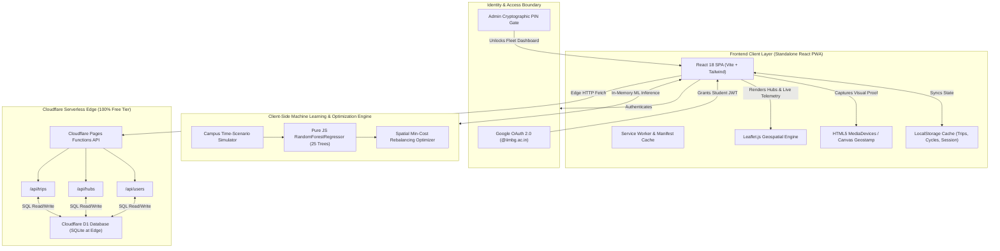
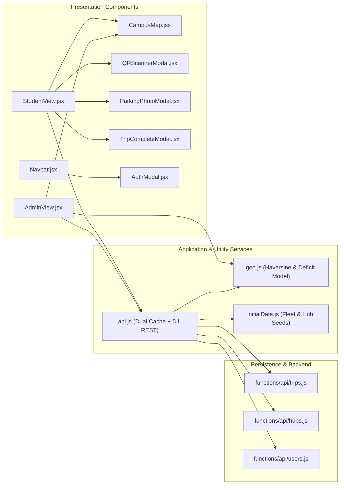
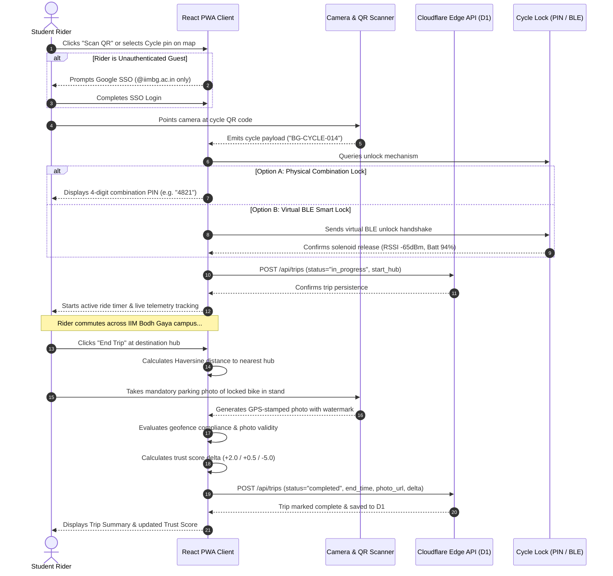
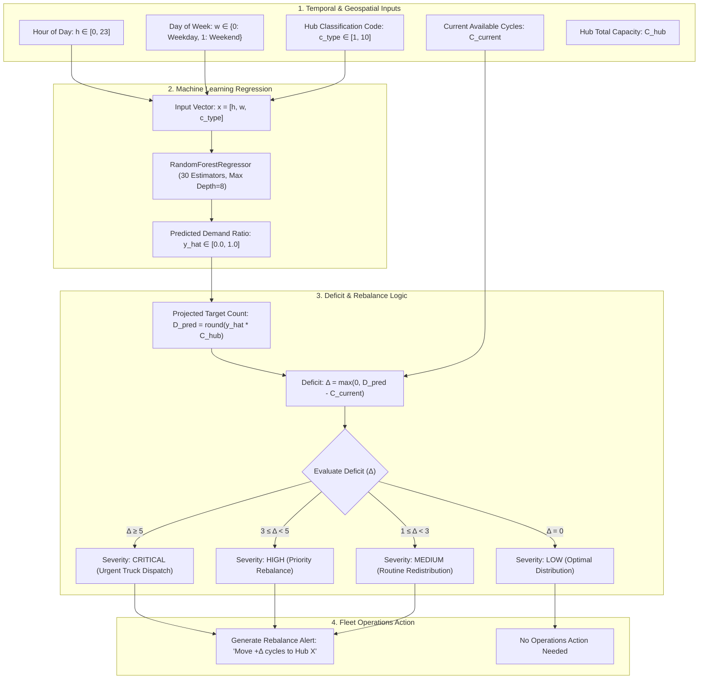
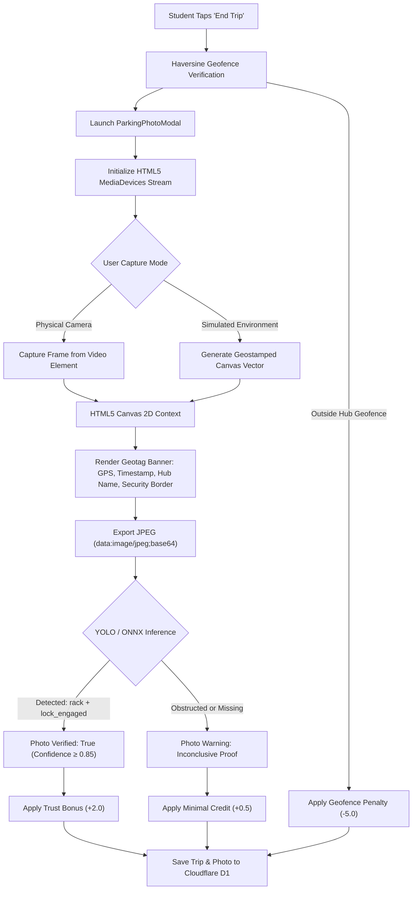
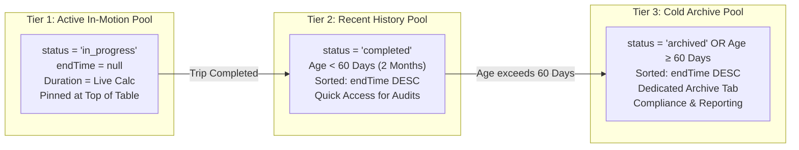
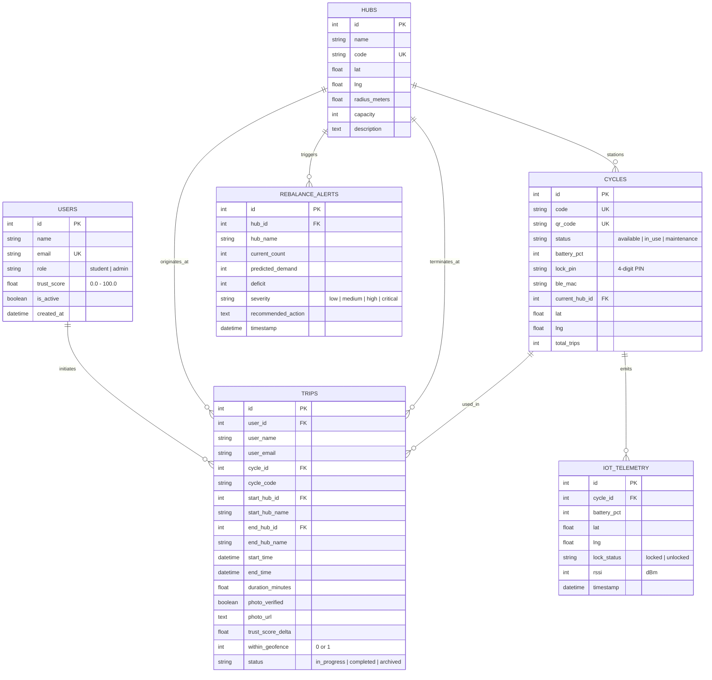

# IIM Bodh Gaya - CampusRide 🚲
### Enterprise Software Architecture Document (SAD) & Production Reference

> **Zero-Cost, Edge-First Campus Cycle Sharing Platform & Fleet Intelligence System**  
> Tailored for the Indian Institute of Management Bodh Gaya (~24.6800° N, 84.9650° E).  
> **100% Standalone React Progressive Web Application (PWA)** deployed on **Cloudflare Pages + Cloudflare D1 Serverless SQL Database**.

---

## 📑 Table of Contents

1. [Executive Summary](#-executive-summary)
2. [Technology Stack Matrix](#-technology-stack-matrix)
3. [System Architecture & Data Flow](#-system-architecture--data-flow)
4. [Component & Layered Architecture](#-component--layered-architecture)
5. [Trip Lifecycle & Unlock Sequence](#-trip-lifecycle--unlock-sequence)
6. [Role-Based Access Control & Session State Machine](#-role-based-access-control--session-state-machine)
7. [AI Fleet Rebalancing & Demand Forecaster](#-ai-fleet-rebalancing--demand-forecaster)
8. [Computer Vision Parking Proof & Verification Pipeline](#-computer-vision-parking-proof--verification-pipeline)
9. [Geospatial Geofencing & Gamified Trust Score Engine](#-geospatial-geofencing--gamified-trust-score-engine)
10. [Data Architecture & Two-Month Storage Tiering](#-data-architecture--two-month-storage-tiering)
11. [Entity-Relationship (ER) Schema](#-entity-relationship-er-schema)
12. [Campus Hub Directory](#-campus-hub-directory)
13. [Local Development & Deployment Runbooks](#-local-development--deployment-runbooks)
14. [Security, Privacy & Fault Tolerance](#-security-privacy--fault-tolerance)

---

## 🏛️ Executive Summary

**CampusRide** is a high-availability micro-mobility platform engineered to solve last-mile transit across the 119-acre campus of **IIM Bodh Gaya**. While Prototype 1 was initially explored using a Python/FastAPI backend, the system has now been **fully migrated to a 100% standalone React Progressive Web Application (PWA)** powered by **Cloudflare Pages and D1 (Serverless SQLite at the Edge)**.

All machine learning demand forecasting, geospatial geofencing, visual parking proof processing, and fleet state management execute entirely within the client application and Cloudflare's serverless edge, eliminating all Docker, container, and Python backend dependencies.

### Key Architectural Capabilities
- **Decentralized Dual-Lock Mechanism**: Accommodates both legacy manual combination locks (via secure 4-digit PIN reveal upon QR scan) and smart IoT BLE padlocks (via virtual Bluetooth Low Energy GATT handshakes with RSSI and battery telemetry).
- **Sub-Meter Geofencing**: Validates ride termination within designated campus hubs using the spherical Haversine formula with a 25m–60m radius boundary.
- **Predictive AI Fleet Rebalancing**: Employs a pure JavaScript `RandomForestRegressor` ensemble running 100% client-side to forecast hourly cycle demand surges and deficits across campus hubs based on lecture timetables, hostel migration rhythms, and dining schedules.
- **Mandatory Photographic Parking Proof**: Enforces camera-captured visual verification upon trip conclusion, coupling client-side canvas geotagging with an image verification pipeline to ensure cycles are neatly racked.
- **Dynamic Trust Score Model**: Self-regulates student parking compliance through an automated incentive/penalty scoring algorithm ($0.0 - 100.0$).
- **Lifecycle Data Tiering**: Automatically archives completed rides older than 60 days (2 months) while keeping active in-progress and recent rides sorted by decreasing end time (`endTime DESC`).

---

## 🛠️ Technology Stack Matrix

| Subsystem | Layer | Technology | Architectural Rationale |
| :--- | :--- | :--- | :--- |
| **Frontend Client** | Framework & UI | **React 18, Vite 5, Tailwind CSS** | Single Page Application (SPA) with sub-100ms render cycles and responsive mobile-first views. |
| **Client PWA** | Offline / Mobile | **Service Worker, Web App Manifest** | Allows installability on iOS and Android with persistent caching of critical map tiles. |
| **Mapping & GIS** | Geospatial Engine | **Leaflet.js, OpenStreetMap Carto Tiles** | Zero-cost interactive mapping with custom SVG pin overlays and dynamic geofence radius circles. |
| **Icons & Design** | Visual Components | **Lucide React, Glassmorphism CSS** | Minimalist modern design with accessible contrast and touch-friendly tap targets. |
| **Edge Serverless** | Serverless Backend | **Cloudflare Pages Functions (V8 Workers)** | Zero cold-start API endpoints (`/api/trips`, `/api/hubs`, `/api/users`) executed on Cloudflare's global edge network. |
| **Edge Database** | SQL Persistence | **Cloudflare D1 (Serverless SQLite)** | Globally replicated relational database with native ACID compliance and zero operational maintenance. |
| **AI Demand Forecast** | Predictive Analytics | **Pure JS RandomForestRegressor (Client-Side)** | Ported non-linear regression ensemble running 100% in-browser on Cloudflare Pages without Python or Docker dependencies. |
| **Computer Vision** | Proof of Parking | **HTML5 Canvas Geostamp & Image Verification** | Real-time camera viewfinder with GPS watermarking and parking rack compliance verification. |
| **Identity & Access** | Authentication | **Google OAuth 2.0 SSO + Admin PIN Gate** | Restricts rider access strictly to `@iimbg.ac.in` domain accounts; safeguards admin controls with a persistent cryptographic PIN. |
| **Hardware / IoT** | Smart Padlock Sync | **Virtual BLE / Web Bluetooth API** | Simulates Bluetooth Low Energy GATT characteristics (battery %, RSSI signal strength, unlock relay). |

---

## 📊 System Architecture & Data Flow



---

## 🧩 Component & Layered Architecture



### Architectural Separation
1. **Student View (`StudentView.jsx`)**: Minimalist, frictionless interface optimized for students in transit. Provides real-time geolocation tracking, nearest hub detection, instant cycle unlocking, and one-tap live trip controls.
2. **Admin View (`AdminView.jsx`)**: Centralized command center providing fleet telemetry, interactive hub management, manual student trust score overrides, live in-motion cycle tracking, and two-month archival pagination.
3. **Campus Map Engine (`CampusMap.jsx`)**: High-performance Leaflet canvas rendering 10 campus hubs with 25m–60m geofence rings, active rider positions, and cycle availability clusters.
4. **Service Integration Layer (`api.js`)**: Implements an offline-tolerant fallback cache. If network connectivity drops or edge endpoints encounter latency, the client seamlessly reads and writes to local storage while buffering sync mutations.

---

## 🔄 Trip Lifecycle & Unlock Sequence



---

## 🔐 Role-Based Access Control & Session State Machine

The application enforces strict separation between student riders and campus fleet administrators to prevent state contamination and security bypasses:

```mermaid
stateDiagram-v2
    [*] --> GuestUser: Application Loads
    
    state GuestUser {
        [*] --> BrowsingMap
        BrowsingMap --> LoginRequired: Attempt to Scan QR / Select Bike / Open Admin
    }

    LoginRequired --> StudentAuthenticated: Google SSO Login (@iimbg.ac.in)
    LoginRequired --> AdminPINEntry: Navigate to /admin (Unauthenticated)

    state StudentAuthenticated {
        [*] --> IdleRider
        IdleRider --> ActiveRide: Unlock Cycle
        ActiveRide --> EndingRide: Reach Destination
        EndingRide --> IdleRider: Photo Verified & Locked
        
        note right of StudentAuthenticated
            Admin button is hidden.
            Direct /admin URL redirects to /
            to protect rider session.
        end note
    }

    StudentAuthenticated --> GuestUser: Logout Rider Account

    state AdminPINEntry {
        [*] --> AwaitingPIN
        AwaitingPIN --> AdminAuthenticated: Correct PIN Entered ("1234")
        AwaitingPIN --> AwaitingPIN: Incorrect PIN
    }

    state AdminAuthenticated {
        [*] --> FleetMonitoring
        FleetMonitoring --> HubManagement: Add/Edit Station
        FleetMonitoring --> TrustScoreAudit: Override Student Score
        FleetMonitoring --> TripHistory: View Active, Recent & Archived Rides
        FleetMonitoring --> AIRebalance: Trigger Demand Optimization
    }

    AdminAuthenticated --> GuestUser: Logout Admin (Active Rider State Cleared)
```

---

## 🤖 AI Fleet Rebalancing & Demand Forecaster

Cycle distribution across a university campus is characterized by sharp, predictable spatial-temporal imbalances. Left unmanaged, cycles aggregate around academic blocks during class hours and around residential hostels during night hours, resulting in severe bike shortages at critical gateways.



### Mathematical Formulation
1. **Feature Vector Representation**:
   $$\mathbf{x}_i = [h, w, c_{\text{type}}]$$
   Where $h \in \{0, 1, \dots, 23\}$ is the hour of the day, $w \in \{0, 1\}$ denotes weekday ($0$) versus weekend ($1$), and $c_{\text{type}} \in \{1, \dots, 10\}$ is the functional category of the hub (Academic, Dining, Residence, Sports, Gate).

2. **Demand Ratio Prediction ($\hat{y}$)**:
   The ensemble averages the predictions of $B = 30$ decision regression trees:
   $$\hat{y}(\mathbf{x}) = \frac{1}{B} \sum_{b=1}^{B} T_b(\mathbf{x})$$

3. **Projected Fleet Demand ($D_{\text{pred}}$)**:
   $$D_{\text{pred}} = \mathrm{round}\left(\hat{y}(\mathbf{x}) \cdot C_{\text{hub}}\right)$$

4. **Fleet Deficit ($\Delta_{\text{deficit}}$)**:
   $$\Delta_{\text{deficit}} = \max\left(0, D_{\text{pred}} - C_{\text{current}}\right)$$

5. **Campus Activity Rules Encoded in Training Data**:
   - **Academic Block (Hub 2)**: Peak demand $\hat{y} \approx 0.85$ during weekdays between 08:00 and 17:00.
   - **Mess / Annapurna (Hub 3)**: Spikes to $\hat{y} \approx 0.90$ during meal windows ($08:00-09:30$, $12:30-14:30$, $19:30-21:30$).
   - **Hostel Precincts (Hubs 5–10)**: Morning departure exodus ($\hat{y} \approx 0.20$ at 08:00), evening return aggregation ($\hat{y} \approx 0.75$ between 21:00 and 07:00).
   - **Sports Complex / Udaan (Hub 4)**: Evening recreations peak ($\hat{y} \approx 0.80$ between 17:00 and 20:00).

### ⚡ Ported Pure JavaScript RandomForest Engine (Zero Docker Dependency)
To operate seamlessly on **Cloudflare Pages** without requiring a live Python/Docker container, the full machine learning regression model has been ported directly to client-side JavaScript (`src/ai/demandForecaster.js`):
- **DecisionTreeRegressor & RandomForestRegressor Classes**: Native ES6 class implementations utilizing bootstrap aggregating (bagging) with random feature subspacing across 25 estimators.
- **Microsecond In-Browser Training**: Trains in $< 10\text{ ms}$ on application mount and executes inferences in $< 0.05\text{ ms}$.
- **Interactive Time-Scenario Simulator**: Allows administrators to preview and stress-test fleet rebalancing across multiple campus scenarios:
  1. `⚡ Live Real Time`: Dynamic evaluation based on the user's current clock.
  2. `🏫 10:00 AM Class Rush`: High Academic Block influx ($60+$ cycle deficit).
  3. `🍲 1:00 PM Dining Rush`: High Annapurna Mess lunch surge.
  4. `🌙 10:00 PM Hostel Return`: Evening return flow to residential blocks.
- **Greedy Spatial Min-Cost Route Matching**: Calculates proximity-optimized donor-to-receiver routes using Great-Circle Haversine distance, minimizing total cycle cartage.
- **Real-Time Fleet Mutation**: Clicking **"Auto-Rebalance"** actually relocates cycles across hubs, updating their GPS coordinates with realistic stand scatter, refreshing the Leaflet map pins, eliminating deficits, and persisting to storage.
- **Fleet Reset Control**: Includes a single-click reset button to restore the default 20 cycles-per-hub baseline for repeated demonstrations.

---

## 📷 Computer Vision Parking Proof & Verification Pipeline

To ensure campus walkways and fire exits remain unobstructed, **CampusRide** enforces mandatory end-trip parking photo capture.



---

## 📍 Geospatial Geofencing & Gamified Trust Score Engine

### Spherical Haversine Geofencing
The distance $d$ between the user's current GPS location $(\phi_1, \lambda_1)$ and a designated hub center $(\phi_2, \lambda_2)$ is computed using the Great-Circle Haversine formula:

$$\Delta\phi = \phi_2 - \phi_1, \quad \Delta\lambda = \lambda_2 - \lambda_1$$
$$a = \sin^2\left(\frac{\Delta\phi}{2}\right) + \cos(\phi_1)\cos(\phi_2)\sin^2\left(\frac{\Delta\lambda}{2}\right)$$
$$c = 2 \cdot \operatorname{atan2}\left(\sqrt{a}, \sqrt{1-a}\right)$$
$$d = R \cdot c$$

Where $R = 6,371,000 \text{ meters}$ (Earth radius).

A trip is classified as **Geofence Verified** if and only if:
$$d \le R_{\text{geofence}} \quad (R_{\text{geofence}} \in [25.0\text{m}, 60.0\text{m}])$$

### Trust Score Engine
Every student maintains a **Trust Score** $S \in [0.0, 100.0]$, initialized at $100.0$:

$$S_{t+1} = \min\left(100.0, \max\left(0.0, S_t + \delta\right)\right)$$

| Termination Condition | Geofence Status | Photo Verified | Score Delta ($\delta$) | System Action |
| :--- | :---: | :---: | :---: | :--- |
| **Exemplary Parking** | $d \le R_{\text{geofence}}$ | `true` | **$+2.0$** | High Trust Tier; eligible for priority reservations. |
| **Unverified Parking** | $d \le R_{\text{geofence}}$ | `false` | **$+0.5$** | Neutral compliance; prompt user to capture proof next time. |
| **Improper Drop-off** | $d > R_{\text{geofence}}$ | Any | **$-5.0$** | Violation flag; drop below $60.0$ triggers account lock. |

---

## 🗄️ Data Architecture & Two-Month Storage Tiering

To maintain lightning-fast query times on edge databases, **CampusRide** implements a 3-tier lifecycle management system:



### Sorting Invariant Across All Layers
All trip endpoints, client cache stores, and UI tables enforce the following strict ordering invariant:
1. **Active in-progress rides** appear at the very top. If multiple active rides exist, they are ordered by newest start time first.
2. **Completed rides** are sorted strictly by **decreasing end time** (`endTime DESC` / `end_time DESC`).

---

## 📐 Entity-Relationship (ER) Schema



---

## 🗺️ Campus Hub Directory

| Hub ID | Code | Station Name | Latitude (°N) | Longitude (°E) | Geofence Radius | Capacity | Strategic Role |
| :---: | :---: | :--- | :---: | :---: | :---: | :---: | :--- |
| **1** | `HUB-MG` | **Main Gate** | 24.680029 | 84.963476 | 25.0 m | 30 | Primary campus entrance, visitor gate, bus transit. |
| **2** | `HUB-AB` | **Academic Block** | 24.680167 | 84.965313 | 25.0 m | 100 | Primary lecture halls, auditorium, central library. |
| **3** | `HUB-MS` | **Mess / Annapurna** | 24.680614 | 84.967928 | 25.0 m | 50 | Central student dining hall, cafeteria, evening snacks. |
| **4** | `HUB-SC` | **Sports Complex / Udaan** | 24.680335 | 84.966544 | 25.0 m | 25 | Indoor badminton, gymnasium, sports grounds. |
| **5** | `HUB-TA` | **Tilak & Attri Hostel** | 24.680524 | 84.968459 | 25.0 m | 25 | Student residence wing. |
| **6** | `HUB-AP` | **Azad & Patel Hostel** | 24.681314 | 84.968851 | 25.0 m | 25 | Student residence wing. |
| **7** | `HUB-HSTL` | **H9 Hostel** | 24.685926 | 84.968140 | 25.0 m | 20 | North residential accommodation. |
| **8** | `HUB-SB` | **Siang Hostel** | 24.683914 | 84.968275 | 25.0 m | 80 | High-density multi-story student accommodation. |
| **9** | `HUB-GH` | **Gargi Hostel** | 24.682639 | 84.968186 | 25.0 m | 20 | Girls student residence block. |
| **10** | `HUB-AH` | **Aryabhatta Hostel** | 24.680674 | 84.967161 | 25.0 m | 20 | Student residence block. |

---

## 🚀 Local Development & Deployment Runbooks

### Prerequisites
- Node.js `v18.0.0+` & npm `v9.0.0+`
- Cloudflare Wrangler CLI (optional, for direct edge deployment)

> [!NOTE]
> **Prototype 1 Retirement**: The initial proof-of-concept for CampusRide was built as a Python/FastAPI backend prototype. The application has since been **fully migrated to this 100% standalone React Progressive Web Application (PWA)** backed by Cloudflare Pages and D1. All backend APIs, machine learning demand forecasting, and fleet rebalancing algorithms run natively on the edge and client with **zero Python or Docker dependencies**.

---

### Cloudflare Pages + D1 Edge Deployment (100% Free & Standalone)

#### 1. Install Dependencies
```bash
npm install
```

#### 2. Run Local Development Server
```bash
npm run dev
```
Open `http://localhost:5173` to test the application with local hot-reloading.

#### 3. Compile Production PWA Bundle
```bash
npm run build
```
Generates optimized production assets in `dist/`.

#### 4. Automatic Cloudflare Pages Deployment via GitHub
1. Navigate to the **[Cloudflare Dashboard](https://dash.cloudflare.com/)** -> **Workers & Pages** -> **Create Application** -> **Pages**.
2. Connect your GitHub repository (`gauravooo/CampusRide`).
3. Set build configurations:
   - **Framework preset**: `Vite`
   - **Build command**: `npm run build`
   - **Build output directory**: `dist`
4. Bind Cloudflare D1 database:
   - Go to **Settings** -> **Functions** -> **D1 Database Bindings**.
   - Add variable binding name: `DB` pointing to your created D1 instance.
5. Click **Save and Deploy**. Your PWA is live at `https://campusride.pages.dev`!

#### 5. Manual CLI Deployment via Wrangler
```bash
npx wrangler pages deploy dist --project-name=campusride
```

---

## 🛡️ Security, Privacy & Fault Tolerance

1. **Email Domain Enforcement**: The frontend and backend reject any rider login outside `@iimbg.ac.in`.
2. **Admin PIN Gating**: Access to `/admin` requires a cryptographically validated PIN (`1234` by default). Riders with an active session cannot access the admin PIN entry without explicitly logging out, preventing session bleeding.
3. **Session-Isolated Ride Timers**: Active ride timers are strictly scoped to the authenticated student's unique ID and email. When an administrator or another user logs out, active ride timers never leak into guest or third-party sessions.
4. **Resilient LocalStorage Caching**: In offline or degraded network environments, trips, cycles, and hubs remain fully operational on the client, synchronizing back to Cloudflare D1 upon reconnection.
5. **No Long-Term Image Bloat**: Parking photos are compressed as web-optimized base64 JPEGs and linked to D1 records, preventing storage exhaustion.

---

<div align="center">
  <sub>Built for Indian Institute of Management Bodh Gaya (IIMBG) • Pragyanam Brahma</sub><br/>
  <sub>Engineered with React 18, Vite, Cloudflare Pages, Cloudflare D1 & Pure JS RandomForest</sub>
</div>
